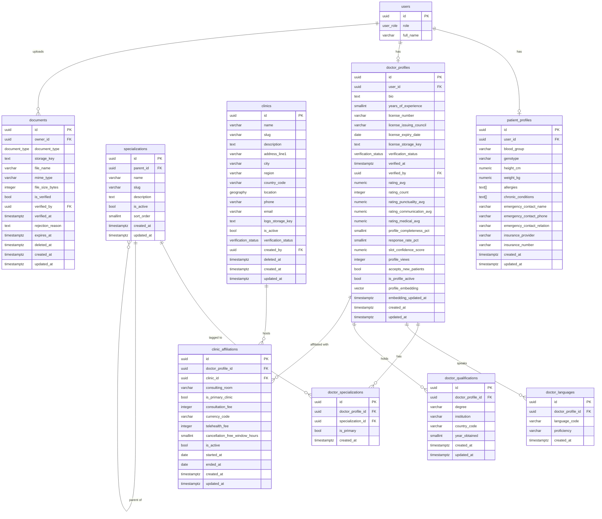
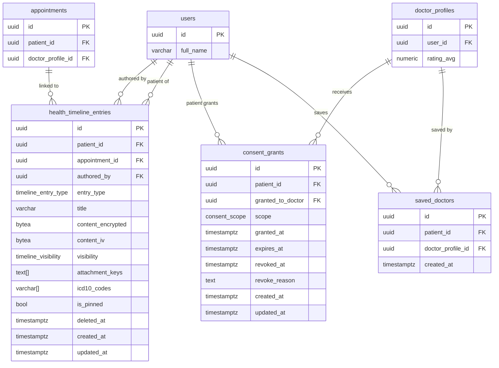

# Veridian — Document 1 of 10: Database Schema & ERD

**Project:** Veridian All-in-One Service Booking Platform  
**Version:** 1.0  
**Status:** Authoritative — all Django models, Supabase tables, and RLS policies derive from this document  
**Platform:** Supabase (PostgreSQL 15+) with pgvector and PostGIS extensions

---

## Overview

The Veridian schema is organized into four layers:

1. **Shared Platform Layer** — identity, auth, notifications, payments, audit, and feature flags. These tables serve every service vertical (medical, barber, mechanic) without modification.
2. **Doctor Booking Vertical** — patient profiles, doctor profiles, clinics, availability, slots, appointments, health records, and telehealth.
3. **Future Verticals** — barber and mechanic tables will be added as new Django apps. They reuse Layer 1 entirely.
4. **Cross-cutting** — soft delete, audit trail, and RLS policies applied universally.

**Totals:** 32 tables · 18 enums · 42 indexes · 26 triggers · 22 RLS policies

---

## Design Conventions

| Convention   | Rule                                                                                                                                                                   |
| ------------ | ---------------------------------------------------------------------------------------------------------------------------------------------------------------------- |
| Primary keys | UUID everywhere (`gen_random_uuid()`). No sequential integers exposed to clients.                                                                                      |
| Timestamps   | Every table has `created_at TIMESTAMPTZ` and `updated_at TIMESTAMPTZ`. Auto-updated via trigger.                                                                       |
| Soft delete  | Sensitive tables have `deleted_at TIMESTAMPTZ`. NULL = active. Application filters on `WHERE deleted_at IS NULL`.                                                      |
| Money        | Stored as `INTEGER` in minor units (pesewas for GHS, cents for USD) + `VARCHAR(3) currency_code` (ISO 4217). Never `FLOAT` or `NUMERIC` for money.                     |
| Enums        | All finite-state fields use PostgreSQL `CREATE TYPE ... AS ENUM`. Never raw strings or magic integers.                                                                 |
| Arrays       | PostgreSQL native arrays (`TEXT[]`, `UUID[]`) used for small, stable sets. Avoid for anything requiring querying or joining — use a junction table instead.            |
| JSONB        | Used for schema-flexible data: pre-consultation responses, provider webhook payloads, form field definitions. Always has a documented internal schema in this file.    |
| Encryption   | Health record content (`health_timeline_entries.content_encrypted`) is AES-256 encrypted at the application level before storage. The database stores ciphertext only. |
| Embeddings   | `doctor_profiles.profile_embedding` is a `VECTOR(1536)` column (pgvector). Indexed with `ivfflat` for approximate nearest-neighbour search.                            |
| Location     | Clinic coordinates stored as `GEOGRAPHY(POINT, 4326)` (PostGIS). Enables ST_DWithin proximity queries.                                                                 |

---

## ERD — Layer 1: Shared Platform Tables

```mermaid
erDiagram
    users {
        uuid id PK
        varchar email
        varchar phone
        bool phone_verified
        bool email_verified
        varchar password
        user_role role
        varchar full_name
        varchar preferred_language
        text avatar_storage_key
        varchar timezone
        date date_of_birth
        gender gender
        bool is_active
        timestamptz last_login_at
        timestamptz deleted_at
        timestamptz created_at
        timestamptz updated_at
    }

    user_auth_providers {
        uuid id PK
        uuid user_id FK
        varchar provider
        varchar provider_uid
        text access_token
        text refresh_token
        timestamptz expires_at
        timestamptz created_at
        timestamptz updated_at
    }

    device_tokens {
        uuid id PK
        uuid user_id FK
        text token
        varchar platform
        bool is_active
        timestamptz last_used_at
        timestamptz created_at
        timestamptz updated_at
    }

    refresh_token_blocklist {
        uuid jti PK
        uuid user_id FK
        timestamptz revoked_at
        timestamptz expires_at
    }

    service_categories {
        uuid id PK
        service_category slug
        varchar display_name
        text description
        text icon_key
        bool is_active
        smallint sort_order
        timestamptz created_at
        timestamptz updated_at
    }

    feature_flags {
        uuid id PK
        varchar key
        text description
        bool is_enabled
        smallint rollout_pct
        user_role[] allowed_roles
        jsonb metadata
        timestamptz created_at
        timestamptz updated_at
    }

    audit_log {
        bigint id PK
        uuid actor_id FK
        varchar table_name
        uuid record_id
        varchar action
        jsonb before_state
        jsonb after_state
        inet ip_address
        text user_agent
        timestamptz created_at
    }

    notification_templates {
        uuid id PK
        varchar key
        notification_channel channel
        varchar language
        text subject
        text body_template
        timestamptz created_at
        timestamptz updated_at
    }

    notification_log {
        uuid id PK
        uuid recipient_id FK
        varchar template_key
        notification_channel channel
        notification_status status
        jsonb payload
        text provider_message_id
        text error_message
        timestamptz sent_at
        timestamptz delivered_at
        timestamptz created_at
        timestamptz updated_at
    }

    notification_preferences {
        uuid id PK
        uuid user_id FK
        varchar event_category
        notification_channel channel
        bool is_enabled
        timestamptz created_at
        timestamptz updated_at
    }

    payment_transactions {
        uuid id PK
        uuid payer_id FK
        uuid appointment_id FK
        payment_provider provider
        varchar provider_reference
        integer amount
        varchar currency_code
        payment_status status
        jsonb provider_response
        integer refunded_amount
        text refund_reason
        timestamptz captured_at
        timestamptz failed_at
        timestamptz refunded_at
        timestamptz deleted_at
        timestamptz created_at
        timestamptz updated_at
    }

    payouts {
        uuid id PK
        uuid recipient_id FK
        payment_provider provider
        varchar provider_reference
        integer gross_amount
        integer platform_fee
        integer net_amount
        varchar currency_code
        payout_status status
        date period_start
        date period_end
        uuid[] appointment_ids
        jsonb provider_response
        timestamptz processed_at
        timestamptz failed_at
        text failure_reason
        timestamptz created_at
        timestamptz updated_at
    }

    bank_accounts {
        uuid id PK
        uuid user_id FK
        varchar bank_name
        varchar bank_code
        varchar account_number
        varchar account_name
        bool is_verified
        bool is_primary
        varchar currency_code
        timestamptz deleted_at
        timestamptz created_at
        timestamptz updated_at
    }

    users ||--o{ user_auth_providers : "has"
    users ||--o{ device_tokens : "registers"
    users ||--o{ refresh_token_blocklist : "revokes"
    users ||--o{ notification_log : "receives"
    users ||--o{ notification_preferences : "configures"
    users ||--o{ payment_transactions : "makes"
    users ||--o{ payouts : "receives"
    users ||--o{ bank_accounts : "owns"
    users ||--o| audit_log : "authors"
```



---

## ERD — Layer 2: Doctor Booking Vertical (Part A — Providers & Clinics)



---

## ERD — Layer 2: Doctor Booking Vertical (Part B — Scheduling & Appointments)

```mermaid
erDiagram
    doctor_profiles {
        uuid id PK
        uuid user_id FK
    }

    clinic_affiliations {
        uuid id PK
        uuid doctor_profile_id FK
        uuid clinic_id FK
        integer consultation_fee
        varchar currency_code
        smallint cancellation_free_window_hours
    }

    availability_templates {
        uuid id PK
        uuid doctor_profile_id FK
        uuid clinic_affiliation_id FK
        day_of_week day_of_week
        time start_time
        time end_time
        smallint slot_duration_minutes
        booking_mode booking_mode
        smallint buffer_minutes
        smallint max_patients_per_slot
        bool is_active
        date effective_from
        date effective_until
        timestamptz created_at
        timestamptz updated_at
    }

    slots {
        uuid id PK
        uuid doctor_profile_id FK
        uuid clinic_affiliation_id FK
        uuid template_id FK
        date slot_date
        time start_time
        time end_time
        booking_mode booking_mode
        slot_status status
        numeric confidence_score
        text block_reason
        uuid blocked_by FK
        timestamptz blocked_at
        timestamptz reserved_at
        timestamptz reservation_expires_at
        timestamptz created_at
        timestamptz updated_at
    }

    pre_consultation_form_templates {
        uuid id PK
        uuid doctor_profile_id FK
        varchar name
        text description
        jsonb fields
        bool is_default
        bool is_active
        smallint version
        timestamptz created_at
        timestamptz updated_at
    }

    appointments {
        uuid id PK
        uuid slot_id FK
        uuid patient_id FK
        uuid doctor_profile_id FK
        uuid clinic_affiliation_id FK
        appointment_status status
        booking_mode booking_mode
        integer consultation_fee
        varchar currency_code
        numeric platform_fee_pct
        uuid payment_transaction_id FK
        uuid form_template_id FK
        jsonb pre_consultation_responses
        text patient_notes
        smallint estimated_wait_minutes
        timestamptz actual_start_time
        timestamptz actual_end_time
        varchar telehealth_room_id
        text telehealth_room_url
        text telehealth_patient_url
        timestamptz telehealth_room_expires_at
        timestamptz cancelled_at
        text cancellation_reason
        uuid cancelled_by FK
        timestamptz no_show_marked_at
        uuid no_show_marked_by FK
        bool follow_up_recommended
        text follow_up_notes
        uuid follow_up_appointment_id FK
        timestamptz deleted_at
        timestamptz created_at
        timestamptz updated_at
    }

    appointment_status_history {
        uuid id PK
        uuid appointment_id FK
        appointment_status from_status
        appointment_status to_status
        uuid actor_id FK
        text reason
        jsonb metadata
        timestamptz created_at
    }

    telehealth_sessions {
        uuid id PK
        uuid appointment_id FK
        varchar provider
        varchar room_name
        text room_url
        timestamptz doctor_joined_at
        timestamptz patient_joined_at
        timestamptz ended_at
        integer duration_seconds
        numeric quality_score
        varchar provider_session_id
        timestamptz created_at
        timestamptz updated_at
    }

    reviews {
        uuid id PK
        uuid appointment_id FK
        uuid patient_id FK
        uuid doctor_profile_id FK
        smallint rating_overall
        smallint rating_punctuality
        smallint rating_communication
        smallint rating_medical
        text review_text
        text doctor_reply
        timestamptz doctor_replied_at
        review_status status
        text flag_reason
        bool is_anonymous
        timestamptz deleted_at
        timestamptz created_at
        timestamptz updated_at
    }

    doctor_profiles ||--o{ availability_templates : "defines"
    clinic_affiliations ||--o{ availability_templates : "scopes"
    availability_templates ||--o{ slots : "generates"
    doctor_profiles ||--o{ slots : "owns"
    slots ||--o| appointments : "booked as"
    doctor_profiles ||--o{ appointments : "attends"
    clinic_affiliations ||--o{ appointments : "located at"
    pre_consultation_form_templates ||--o{ appointments : "used in"
    appointments ||--o{ appointment_status_history : "logs"
    appointments ||--o| telehealth_sessions : "has"
    appointments ||--o| reviews : "reviewed via"
    appointments ||--o| appointments : "follow-up of"
```



---

## ERD — Layer 2: Doctor Booking Vertical (Part C — Health Records & Consent)



---

## Table Reference

### Shared Platform Tables

#### `users`

The single identity table for all roles. Role-specific data lives in `patient_profiles` or `doctor_profiles`.

| Column               | Type         | Constraints                      | Notes                                               |
| -------------------- | ------------ | -------------------------------- | --------------------------------------------------- |
| `id`                 | UUID         | PK                               | `gen_random_uuid()`                                 |
| `email`              | VARCHAR(320) | UNIQUE, nullable                 | Nullable — phone-only signup allowed                |
| `phone`              | VARCHAR(20)  | UNIQUE, nullable                 | E.164 format e.g. `+233201234567`                   |
| `phone_verified`     | BOOLEAN      | NOT NULL, DEFAULT FALSE          |                                                     |
| `email_verified`     | BOOLEAN      | NOT NULL, DEFAULT FALSE          |                                                     |
| `role`               | user_role    | NOT NULL, DEFAULT 'patient'      | Enum: patient, doctor, clinic_admin, platform_admin |
| `full_name`          | VARCHAR(200) | NOT NULL                         |                                                     |
| `preferred_language` | VARCHAR(10)  | NOT NULL, DEFAULT 'en'           | BCP 47 e.g. 'en', 'tw' (Twi)                        |
| `avatar_storage_key` | TEXT         |                                  | Supabase Storage key                                |
| `timezone`           | VARCHAR(60)  | NOT NULL, DEFAULT 'Africa/Accra' | IANA timezone name                                  |
| `date_of_birth`      | DATE         |                                  |                                                     |
| `gender`             | gender       |                                  | Enum: male, female, non_binary, prefer_not_to_say   |
| `is_active`          | BOOLEAN      | NOT NULL, DEFAULT TRUE           | Platform-level ban toggle                           |
| `last_login_at`      | TIMESTAMPTZ  |                                  |                                                     |
| `deleted_at`         | TIMESTAMPTZ  |                                  | Soft delete                                         |
| `created_at`         | TIMESTAMPTZ  | NOT NULL, DEFAULT NOW()          |                                                     |
| `updated_at`         | TIMESTAMPTZ  | NOT NULL, DEFAULT NOW()          | Auto-updated via trigger                            |

**Check constraint:** `email IS NOT NULL OR phone IS NOT NULL`

---

#### `payment_transactions`

One row per payment attempt. `amount` and `refunded_amount` are always in minor units of `currency_code`.

| Column               | Type                   | Notes                                                     |
| -------------------- | ---------------------- | --------------------------------------------------------- |
| `id`                 | UUID PK                |                                                           |
| `payer_id`           | UUID FK → users        |                                                           |
| `appointment_id`     | UUID FK → appointments | Added via deferred ALTER TABLE                            |
| `provider`           | payment_provider       | Enum: paystack, stripe, cash                              |
| `provider_reference` | VARCHAR(255) UNIQUE    | Paystack reference / Stripe PaymentIntent ID              |
| `amount`             | INTEGER                | Minor units (pesewas, cents). CHECK >= 0                  |
| `currency_code`      | VARCHAR(3)             | ISO 4217. DEFAULT 'GHS'                                   |
| `status`             | payment_status         | Enum: pending → authorized → captured / failed / refunded |
| `provider_response`  | JSONB                  | Full raw webhook payload from provider                    |
| `refunded_amount`    | INTEGER                | Must be ≤ amount                                          |
| `refund_reason`      | TEXT                   |                                                           |
| `captured_at`        | TIMESTAMPTZ            | When payment was successfully captured                    |
| `failed_at`          | TIMESTAMPTZ            |                                                           |
| `refunded_at`        | TIMESTAMPTZ            |                                                           |

---

#### `audit_log`

Append-only. Uses `BIGSERIAL` (internal only — never exposed via API). All sensitive table writes are logged here by Django signals.

**Tables that trigger audit entries:** `appointments`, `health_timeline_entries`, `payment_transactions`, `consent_grants`, `doctor_profiles` (verification changes), `users` (role changes).

---

### Doctor Booking Tables

#### `doctor_profiles`

Key computed/denormalized columns:

| Column                     | How it's maintained                                                  |
| -------------------------- | -------------------------------------------------------------------- |
| `rating_avg`               | Recalculated by Django signal on every `reviews` INSERT/UPDATE       |
| `rating_punctuality_avg`   | Same                                                                 |
| `rating_communication_avg` | Same                                                                 |
| `rating_medical_avg`       | Same                                                                 |
| `rating_count`             | Incremented by signal on `reviews` INSERT where status = 'published' |
| `profile_completeness_pct` | Recalculated by Django signal on `doctor_profiles` UPDATE            |
| `response_rate_pct`        | Recalculated by weekly Celery task                                   |
| `slot_confidence_score`    | Recalculated by weekly Celery task (ratio of kept vs blocked slots)  |
| `profile_embedding`        | Regenerated by Celery task on profile UPDATE via OpenAI API          |

---

#### `slots`

**Generated by:** Nightly Celery task (`generate_slots`). Runs at 00:30 WAT, generates slots 60 days from today for all active `availability_templates`.

**Reservation TTL:** When a patient begins a booking, the slot moves to `reserved` and `reservation_expires_at` = `NOW() + 10 minutes`. A Celery Beat task (`expire_slot_reservations`) runs every 2 minutes and returns expired reservations to `available`.

**Unique constraint:** `(doctor_profile_id, slot_date, start_time)` — prevents the nightly task from creating duplicates on re-run.

---

#### `appointments`

**Pre-consultation responses schema (JSONB):**

```json
{
  "field_id_1": "Patient's answer as string",
  "field_id_2": ["option_a", "option_b"],
  "field_id_3": true,
  "field_id_4": "2024-01-15"
}
```

Keys are `pre_consultation_form_templates.fields[*].id` values.

**Telehealth fields:** `telehealth_room_url` is the doctor's URL (contains auth token). `telehealth_patient_url` is the patient's URL. Both are created by the Django API via Daily.co REST API at booking confirmation time and stored here. They become visible to the patient 15 minutes before appointment time (controlled at the API response layer, not the database layer).

---

#### `pre_consultation_form_templates` — `fields` JSONB Schema

```json
[
  {
    "id": "uuid-string",
    "label": "What is your reason for visit?",
    "type": "textarea",
    "required": true,
    "placeholder": "Describe your symptoms...",
    "max_length": 1000,
    "conditional_on_field_id": null,
    "conditional_on_value": null
  },
  {
    "id": "uuid-string",
    "label": "Duration of symptoms",
    "type": "select",
    "required": true,
    "options": [
      "Less than 24 hours",
      "1–3 days",
      "4–7 days",
      "More than a week"
    ],
    "conditional_on_field_id": null,
    "conditional_on_value": null
  },
  {
    "id": "uuid-string",
    "label": "Is this a follow-up for a specific condition?",
    "type": "boolean",
    "required": false,
    "conditional_on_field_id": null,
    "conditional_on_value": null
  },
  {
    "id": "uuid-string",
    "label": "Which condition?",
    "type": "text",
    "required": true,
    "conditional_on_field_id": "uuid-of-boolean-field-above",
    "conditional_on_value": true
  }
]
```

**Supported field types:** `text`, `textarea`, `select`, `multi_select`, `boolean`, `number`, `date`, `file`

---

#### `health_timeline_entries` — `content_encrypted` Payload (before encryption)

```json
{
  "entry_type": "diagnosis_note",
  "summary": "Presented with acute pharyngitis",
  "details": "Patient reports sore throat for 3 days...",
  "diagnosis": "Acute pharyngitis",
  "icd10_codes": ["J02.9"],
  "prescription": [
    {
      "drug": "Amoxicillin",
      "dosage": "500mg",
      "frequency": "3x daily",
      "duration": "7 days"
    }
  ],
  "follow_up_in_days": 7,
  "doctor_notes": "Private notes visible only to doctor..."
}
```

The `content_iv` column stores the AES-256-CBC initialization vector (16 bytes). The encryption key is derived per-patient from a master secret stored in environment variables (KMS in production).

---

## Enum Reference

| Enum                   | Values                                                                                                                                          |
| ---------------------- | ----------------------------------------------------------------------------------------------------------------------------------------------- |
| `user_role`            | patient, doctor, clinic_admin, platform_admin                                                                                                   |
| `verification_status`  | unverified, pending_review, verified, rejected, suspended                                                                                       |
| `booking_mode`         | in_person, telehealth, either                                                                                                                   |
| `appointment_status`   | requested, confirmed, in_progress, completed, cancelled_by_patient, cancelled_by_doctor, cancelled_by_platform, no_show_patient, no_show_doctor |
| `slot_status`          | available, reserved, booked, blocked, expired                                                                                                   |
| `notification_channel` | push, sms, email, in_app                                                                                                                        |
| `notification_status`  | pending, sent, delivered, failed                                                                                                                |
| `payment_status`       | pending, authorized, captured, failed, refunded, partially_refunded, disputed                                                                   |
| `payment_provider`     | paystack, stripe, cash                                                                                                                          |
| `payout_status`        | pending, processing, completed, failed                                                                                                          |
| `timeline_entry_type`  | symptom_log, diagnosis_note, prescription, lab_result, patient_note, vaccination, allergy_record                                                |
| `timeline_visibility`  | patient_only, shared_with_current_doctor, shared_with_all_future_doctors                                                                        |
| `consent_scope`        | read_timeline, read_prescriptions, read_lab_results, read_all                                                                                   |
| `day_of_week`          | monday, tuesday, wednesday, thursday, friday, saturday, sunday                                                                                  |
| `service_category`     | medical, barber, mechanic                                                                                                                       |
| `review_status`        | pending, published, flagged, removed                                                                                                            |
| `gender`               | male, female, non_binary, prefer_not_to_say                                                                                                     |
| `document_type`        | medical_license, national_id, proof_of_address, qualification_certificate, lab_result, prescription, insurance_card, other                      |

---

## Index Strategy

### Why these indexes exist

| Index                    | Rationale                                                           |
| ------------------------ | ------------------------------------------------------------------- |
| `idx_slots_doctor_date`  | Core search query: "show me available slots for doctor X on date Y" |
| `idx_slots_reservation`  | Celery expiry task scans only reserved slots                        |
| `idx_doctor_embedding`   | ivfflat for pgvector ANN search (semantic ranking)                  |
| `idx_clinics_location`   | PostGIS GIST index for ST_DWithin proximity queries                 |
| `idx_doctor_rating`      | Filtered index: only verified, active doctors sorted by rating      |
| `idx_appt_patient`       | Patient dashboard: "show my appointments" — ordered by recency      |
| `idx_appt_doctor`        | Doctor dashboard: same, from the doctor's perspective               |
| `idx_timeline_patient`   | Health timeline feed: patient's entries ordered by recency          |
| `idx_audit_table_record` | Audit queries: "show all changes to appointment X"                  |

---

## RLS Policy Summary

| Table                      | Who can read                                          | Who can write                     |
| -------------------------- | ----------------------------------------------------- | --------------------------------- |
| `users`                    | Own row only                                          | Own row only                      |
| `patient_profiles`         | Own row only                                          | Own row only                      |
| `doctor_profiles`          | All (verified + active profiles) / own row            | Own row only                      |
| `slots`                    | All (available + future dates) / doctor owns all      | Doctor (own slots)                |
| `appointments`             | Patient (own) + Doctor (own)                          | Via API only (service layer)      |
| `health_timeline_entries`  | Patient (own) + Doctor (with consent)                 | Patient and Doctor (own authored) |
| `consent_grants`           | Patient (own) + Doctor (granted to them)              | Patient only                      |
| `payment_transactions`     | Payer only                                            | Via API only                      |
| `payouts`                  | Recipient only                                        | Via API only                      |
| `reviews`                  | All (published) / patient (own)                       | Patient (own)                     |
| `saved_doctors`            | Patient (own)                                         | Patient (own)                     |
| `bank_accounts`            | Owner only                                            | Owner only                        |
| `documents`                | Owner only                                            | Owner only                        |
| `telehealth_sessions`      | Patient + Doctor (own appointment)                    | Via API only                      |
| `notification_preferences` | Own only                                              | Own only                          |
| `audit_log`                | Platform admin only (via Django, not Supabase direct) | Append-only via API               |

---

## Django Model Mapping Notes

Every table above maps 1:1 to a Django model. Key Django-specific notes:

- All models inherit from `TimestampedModel` (provides `created_at`, `updated_at`) and optionally `SoftDeleteModel` (provides `deleted_at`, custom manager that filters `deleted_at IS NULL`).
- `user_role`, `verification_status`, `appointment_status`, etc. all map to Django `TextChoices` classes.
- `profile_embedding` (`VECTOR(1536)`) requires `django-pgvector` package (`pgvector.django.VectorField`).
- `location` (`GEOGRAPHY(POINT, 4326)`) requires `django.contrib.gis` (GeoDjango) and `PointField`.
- JSONB fields map to Django `JSONField`.
- Array fields (`TEXT[]`, `UUID[]`) map to `django.contrib.postgres.fields.ArrayField`.
- `content_encrypted` (`BYTEA`) maps to `BinaryField`. Encryption/decryption handled in the model's `save()` and a custom property, not in the database.
- The `audit_log` table is written to via Django signals, not direct ORM calls. Signal handlers are registered in `core/signals.py`.

---

## Migration Notes

- All schema changes go through Django migrations. Never apply raw SQL to production.
- The nightly slot generation task is idempotent — re-running it is safe due to the `UNIQUE (doctor_profile_id, slot_date, start_time)` constraint.
- Adding a new service vertical (e.g., barber) requires: a new value in the `service_category` enum (one migration), a new Django app with its own models, and a new row in `service_categories`. No changes to shared platform tables.
- The `profile_embedding` column can be added as a later migration once semantic search is ready for Phase 2. The `ivfflat` index requires at least a few thousand rows of data before it's effective — create it after initial data load, not before.

---

## Files Produced

| File                          | Description                                                                          |
| ----------------------------- | ------------------------------------------------------------------------------------ |
| `Veridian_schema.sql`         | Full PostgreSQL DDL — run against a fresh Supabase database to initialize the schema |
| `Veridian-database-schema.md` | This document — the authoritative reference                                          |

---

\*Next document: **Document 2 of 10 — API Contract (OpenAPI Spec)\***  
_All API endpoint shapes, request/response schemas, and auth requirements are derived from this schema._
