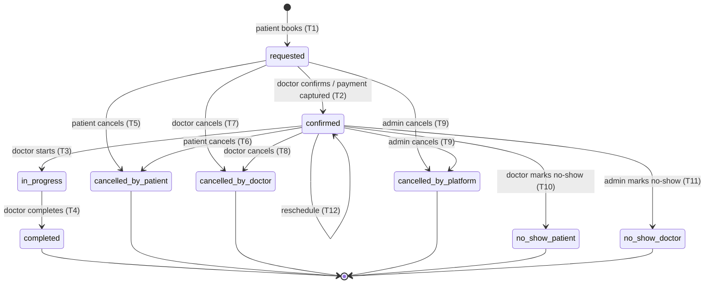
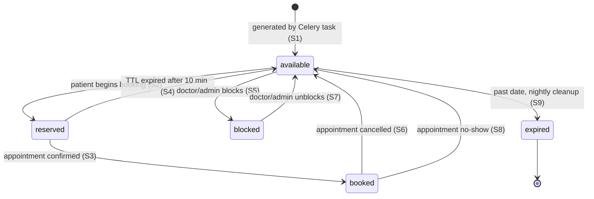
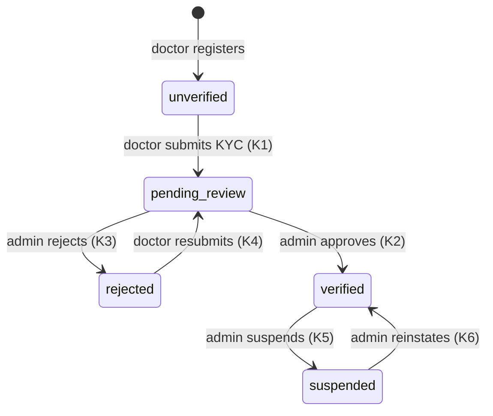
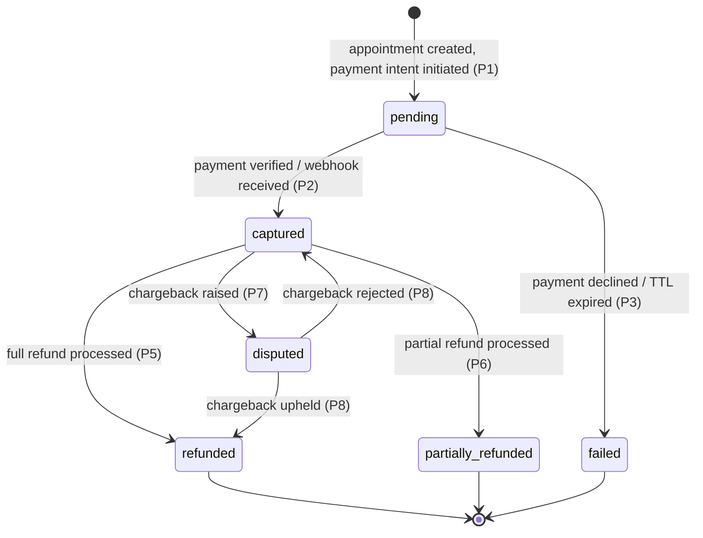

# Veridian — Document 3 of 10: State Machine Definitions

**Project:** Veridian All-in-One Service Booking Platform  
**Version:** 1.0.0  
**Status:** Authoritative — all Django service layer logic, Celery tasks, and client UI state derives from this document

---

## Overview

This document formally specifies every state machine in the Veridian platform. For each machine:

- Every valid **state** is defined with its invariants
- Every valid **transition** is defined with its triggering event, actor, guard conditions, and side effects
- Every **forbidden transition** is explicitly listed
- **Terminal states** are clearly marked

Four machines are defined:

1. **Appointment lifecycle** — the most complex machine; drives the entire booking experience
2. **Slot lifecycle** — governs slot availability, reservation TTL, and blocking
3. **Doctor KYC flow** — governs verification status of doctor profiles
4. **Payment flow** — governs the payment transaction from initiation to settlement

---

## Machine 1: Appointment Lifecycle

### States

| State                   | Description                                         | Invariants                                                                                 |
| ----------------------- | --------------------------------------------------- | ------------------------------------------------------------------------------------------ |
| `requested`             | Appointment created, slot reserved, payment pending | `slot.status = reserved`, `payment_transaction.status = pending` (or null for pay-at-desk) |
| `confirmed`             | Doctor has confirmed; payment captured              | `slot.status = booked`, `payment_transaction.status = captured` (or null for pay-at-desk)  |
| `in_progress`           | Consultation has started                            | `actual_start_time IS NOT NULL`                                                            |
| `completed`             | Consultation finished successfully                  | `actual_start_time IS NOT NULL`, `actual_end_time IS NOT NULL`                             |
| `cancelled_by_patient`  | Patient cancelled                                   | `cancelled_at IS NOT NULL`, `cancelled_by = patient.id`, `slot.status = available`         |
| `cancelled_by_doctor`   | Doctor cancelled                                    | `cancelled_at IS NOT NULL`, `cancelled_by = doctor.user_id`, `slot.status = available`     |
| `cancelled_by_platform` | Platform admin cancelled                            | `cancelled_at IS NOT NULL`, `cancelled_by = admin.id`, `slot.status = available`           |
| `no_show_patient`       | Patient did not attend                              | `no_show_marked_at IS NOT NULL`, `no_show_marked_by = doctor.user_id`                      |
| `no_show_doctor`        | Doctor did not attend                               | `no_show_marked_at IS NOT NULL`, `no_show_marked_by = admin.id`                            |

**Terminal states:** `completed`, `cancelled_by_patient`, `cancelled_by_doctor`, `cancelled_by_platform`, `no_show_patient`, `no_show_doctor`

---

### Transitions

#### T1: `[none] → requested`

```
Event:        POST /appointments (patient submits booking)
Actor:        patient
Guard:
  - slot.status = 'available'
  - slot.slot_date >= TODAY
  - patient.is_active = true
  - doctor_profile.verification_status = 'verified'
  - doctor_profile.is_profile_active = true
  - doctor_profile.accepts_new_patients = true
  - booking_mode is compatible with slot.booking_mode
    (slot='in_person' → only in_person allowed)
    (slot='telehealth' → only telehealth allowed)
    (slot='either' → either allowed)
  - No existing non-terminal appointment for this patient on this slot
Action (atomic, within transaction.atomic()):
  1. SELECT slot FOR UPDATE — abort if status ≠ 'available' → raise SlotUnavailableError
  2. SET slot.status = 'reserved'
  3. SET slot.reserved_at = NOW()
  4. SET slot.reservation_expires_at = NOW() + 10 minutes
  5. CREATE appointment with status = 'requested'
  6. INSERT appointment_status_history (from=null, to='requested', actor=patient)
  7. CREATE payment_transaction (status='pending') via Paystack/Stripe
     → For pay-at-desk: skip payment, auto-transition to T2 immediately
Side effects (async, Celery):
  - notify_booking_created.delay(appointment_id)
    → push + SMS + email to patient: "Booking requested"
    → push + email to doctor: "New booking request"
  - schedule_reservation_expiry.apply_async(
      args=[appointment_id], countdown=600
    )  ← fallback if payment not completed
```

#### T2: `requested → confirmed`

```
Event A:      POST /appointments/{id}/confirm (doctor explicitly confirms)
Event B:      POST /payments/verify succeeds (payment webhook captured for pay-upfront)
Event C:      Auto-transition for pay-at-desk bookings (no payment required)
Actor:        doctor (Event A), system/webhook (Event B, C)
Guard:
  - appointment.status = 'requested'
  - For Event A: request.user.id = appointment.doctor_profile.user_id
  - For Event B: payment_transaction.status = 'captured'
  - slot.reservation_expires_at > NOW() (slot not yet expired)
Action:
  1. SET appointment.status = 'confirmed'
  2. SET slot.status = 'booked'
  3. SET slot.reservation_expires_at = NULL
  4. SET payment_transaction.status = 'captured' (if via payment event)
  5. INSERT appointment_status_history (from='requested', to='confirmed', actor)
Side effects (async, Celery):
  - notify_appointment_confirmed.delay(appointment_id)
    → push + SMS + email to patient: "Appointment confirmed"
  - schedule_reminder_24h.apply_async(
      args=[appointment_id],
      eta=slot_datetime - timedelta(hours=24)
    )
  - schedule_reminder_1h.apply_async(
      args=[appointment_id],
      eta=slot_datetime - timedelta(hours=1)
    )
  - If booking_mode = 'telehealth':
      create_telehealth_room.delay(appointment_id)
      → calls Daily.co API, stores room URLs in appointment.telehealth_room_url
         and appointment.telehealth_patient_url.
      → Clients read URLs via v_appointments_safe, which nulls them until
         slot_datetime - 15 minutes. Both Flutter (Supabase direct read) and
         Next.js/DRF go through this view. The DRF serializer applies an
         equivalent gate so the two paths behave identically.
```

#### T3: `confirmed → in_progress`

```
Event:        POST /appointments/{id}/start
Actor:        doctor
Guard:
  - appointment.status = 'confirmed'
  - request.user.id = appointment.doctor_profile.user_id
  - NOW() >= slot.start_time - 30 minutes  (cannot start too early)
  - NOW() <= slot.start_time + slot_duration + 60 minutes  (cannot start too late)
Action:
  1. SET appointment.status = 'in_progress'
  2. SET appointment.actual_start_time = NOW()
  3. SET appointment.estimated_wait_minutes = MAX(0, (NOW() - slot.start_time).minutes)
  4. INSERT appointment_status_history (from='confirmed', to='in_progress', actor=doctor)
Side effects (async, Celery):
  - If booking_mode = 'telehealth':
      notify_telehealth_started.delay(appointment_id)
      → push + SMS to patient with telehealth_patient_url
  - update_doctor_slot_confidence.delay(doctor_profile_id)
    → increments "started on time" counter
```

#### T4: `in_progress → completed`

```
Event:        POST /appointments/{id}/complete
Actor:        doctor
Guard:
  - appointment.status = 'in_progress'
  - request.user.id = appointment.doctor_profile.user_id
Action:
  1. SET appointment.status = 'completed'
  2. SET appointment.actual_end_time = NOW()
  3. SET appointment.follow_up_recommended = request.follow_up_recommended
  4. SET appointment.follow_up_notes = request.follow_up_notes
  5. INSERT appointment_status_history (from='in_progress', to='completed', actor=doctor)
Side effects (async, Celery):
  - notify_appointment_completed.delay(appointment_id)
    → push to both patient and doctor: "Appointment complete"
  - schedule_review_request.apply_async(
      args=[appointment_id],
      countdown=7200  ← 2 hours
    )
  - queue_for_payout.delay(appointment_id)
    → adds appointment to doctor's next weekly payout batch
  - update_doctor_rating_signals.delay(doctor_profile_id)
    → recalculates response_rate_pct and slot_confidence_score
  - If telehealth: close_telehealth_room.delay(appointment_id)
```

#### T5: `requested → cancelled_by_patient`

```
Event:        POST /appointments/{id}/cancel
Actor:        patient
Guard:
  - appointment.status = 'requested'
  - request.user.id = appointment.patient_id
  - cancellation_reason provided (min 5 chars)
Action:
  1. SET appointment.status = 'cancelled_by_patient'
  2. SET appointment.cancelled_at = NOW()
  3. SET appointment.cancellation_reason = reason
  4. SET appointment.cancelled_by = patient.id
  5. SET slot.status = 'available'
  6. SET slot.reserved_at = NULL
  7. SET slot.reservation_expires_at = NULL
  8. INSERT appointment_status_history
Side effects:
  - Full refund always (payment was pending, not yet captured)
    → void_payment.delay(payment_transaction_id)
  - notify_appointment_cancelled.delay(appointment_id, cancelled_by='patient')
    → push + SMS to patient: "Booking cancelled"
    → push + email to doctor: "Booking cancelled by patient"
```

#### T6: `confirmed → cancelled_by_patient`

```
Event:        POST /appointments/{id}/cancel
Actor:        patient
Guard:
  - appointment.status = 'confirmed'
  - request.user.id = appointment.patient_id
  - cancellation_reason provided
Action:
  1–8: Same structural steps as T5
Side effects:
  - Refund policy applied:
      free_window = clinic_affiliation.cancellation_free_window_hours (default 24)
      hours_until_slot = (slot_datetime - NOW()).hours
      IF hours_until_slot >= free_window:
          refund_amount = consultation_fee  ← full refund
          policy = 'full_refund'
      ELIF hours_until_slot >= free_window / 2:
          refund_amount = consultation_fee * 0.5  ← 50% refund
          policy = 'partial_refund'
      ELSE:
          refund_amount = 0  ← no refund
          policy = 'no_refund'
      process_refund.delay(payment_transaction_id, refund_amount)
  - cancel_scheduled_reminders.delay(appointment_id)
  - notify_appointment_cancelled.delay(appointment_id, cancelled_by='patient')
  - decrement_doctor_response_metric if within 2h of slot (counts as late notice)
```

#### T7: `requested → cancelled_by_doctor`

```
Event:        POST /appointments/{id}/cancel
Actor:        doctor
Guard:
  - appointment.status = 'requested'
  - request.user.id = appointment.doctor_profile.user_id
  - cancellation_reason provided
Action: Same structural steps as T5
Side effects:
  - Full refund always → void_payment.delay(payment_transaction_id)
  - notify_appointment_cancelled.delay(appointment_id, cancelled_by='doctor')
  - decrement_doctor_response_rate.delay(doctor_profile_id)
    → reduces response_rate_pct (cancelling requests hurts discovery ranking)
```

#### T8: `confirmed → cancelled_by_doctor`

```
Event:        POST /appointments/{id}/cancel
Actor:        doctor
Guard:
  - appointment.status = 'confirmed'
  - request.user.id = appointment.doctor_profile.user_id
  - cancellation_reason provided
Action: Same structural steps as T5 + slot freed
Side effects:
  - Full refund always → process_refund.delay(payment_transaction_id, full_amount)
  - cancel_scheduled_reminders.delay(appointment_id)
  - notify_late_cancellation.delay(appointment_id)
    → push + SMS to patient with priority rebooking offer
    → email to patient with priority slot suggestions
  - decrement_doctor_slot_confidence.delay(doctor_profile_id)
    → reduces slot_confidence_score (visible to patients as ⚠ May vary)
  - decrement_doctor_response_rate.delay(doctor_profile_id)
```

#### T9: `requested | confirmed → cancelled_by_platform`

```
Event:        POST /appointments/{id}/cancel (by platform admin)
Actor:        platform_admin
Guard:
  - appointment.status IN ('requested', 'confirmed')
  - request.user.role = 'platform_admin'
  - cancellation_reason provided
Action: Same structural steps + slot freed
Side effects:
  - Full refund always
  - notify_platform_cancellation.delay(appointment_id)
    → notify both parties with explanation
  - If doctor-caused issue: escalate_doctor_review.delay(doctor_profile_id)
```

#### T10: `confirmed → no_show_patient`

```
Event:        POST /appointments/{id}/no-show { no_show_party: 'patient' }
Actor:        doctor
Guard:
  - appointment.status = 'confirmed'
  - request.user.id = appointment.doctor_profile.user_id
  - NOW() >= slot.start_time + slot_duration_minutes  (slot has passed)
Action:
  1. SET appointment.status = 'no_show_patient'
  2. SET appointment.no_show_marked_at = NOW()
  3. SET appointment.no_show_marked_by = doctor.user_id
  4. INSERT appointment_status_history
Side effects:
  - No refund issued (patient did not attend)
  - Doctor still receives partial payout (configurable %, default 50%)
    → queue_no_show_payout.delay(appointment_id, rate=0.5)
  - notify_no_show_recorded.delay(appointment_id)
    → notification to patient: "You missed your appointment"
  - cancel_scheduled_reminders.delay(appointment_id)
```

#### T11: `confirmed → no_show_doctor`

```
Event:        POST /appointments/{id}/no-show { no_show_party: 'doctor' }
Actor:        platform_admin
Guard:
  - appointment.status = 'confirmed'
  - request.user.role = 'platform_admin'
  - NOW() >= slot.start_time + slot_duration_minutes
Action:
  1. SET appointment.status = 'no_show_doctor'
  2. SET appointment.no_show_marked_at = NOW()
  3. SET appointment.no_show_marked_by = admin.id
  4. INSERT appointment_status_history
Side effects:
  - Full refund to patient → process_refund.delay(payment_transaction_id, full_amount)
  - No payout to doctor
  - decrement_doctor_slot_confidence.delay(doctor_profile_id) ← significant penalty
  - decrement_doctor_response_rate.delay(doctor_profile_id)
  - notify_doctor_no_show.delay(appointment_id)
    → notify patient with apology + priority rebooking credit
    → notify doctor with warning
  - If doctor has 3+ no-shows in 30 days:
      flag_for_suspension_review.delay(doctor_profile_id)
```

#### T12: `confirmed → confirmed` (reschedule)

```
Event:        POST /appointments/{id}/reschedule
Actor:        patient or doctor
Guard:
  - appointment.status = 'confirmed'
  - new_slot.status = 'available'
  - new_slot.slot_date >= TODAY
  - new_slot.doctor_profile_id = appointment.doctor_profile_id
  - If patient: NOW() < slot.start_time - cancellation_free_window (within rescheduling window)
  - If doctor: any time before slot.start_time
Action (atomic):
  1. SELECT new_slot FOR UPDATE — abort if status ≠ 'available'
  2. SET old_slot.status = 'available'
  3. SET old_slot.reserved_at = NULL
  4. SET new_slot.status = 'booked'
  5. SET appointment.slot_id = new_slot.id
  6. UPDATE appointment telehealth URLs if booking_mode = 'telehealth'
  7. INSERT appointment_status_history (from='confirmed', to='confirmed', reason='rescheduled')
Side effects:
  - cancel_scheduled_reminders.delay(old_appointment_id)
  - schedule_reminder_24h.delay(appointment_id, new_slot_datetime)
  - schedule_reminder_1h.delay(appointment_id, new_slot_datetime)
  - notify_appointment_rescheduled.delay(appointment_id)
    → notify both parties with new time
  - If telehealth: recreate_telehealth_room.delay(appointment_id)
```

---

### Forbidden Transitions

| From          | To            | Reason                                                    |
| ------------- | ------------- | --------------------------------------------------------- |
| `in_progress` | `confirmed`   | Cannot go backwards                                       |
| `completed`   | any           | Terminal — immutable                                      |
| `cancelled_*` | any           | Terminal — immutable                                      |
| `no_show_*`   | any           | Terminal — immutable                                      |
| `confirmed`   | `in_progress` | Must use start endpoint, not status update                |
| `requested`   | `in_progress` | Must confirm first                                        |
| `requested`   | `completed`   | Must follow full lifecycle                                |
| `in_progress` | `cancelled_*` | Cannot cancel mid-consultation — must complete or no-show |

---

### Appointment State Diagram (Mermaid)



---

## Machine 2: Slot Lifecycle

### States

| State       | Description                                  | Invariants                                                                                        |
| ----------- | -------------------------------------------- | ------------------------------------------------------------------------------------------------- |
| `available` | Slot can be booked                           | `reserved_at IS NULL`, `reservation_expires_at IS NULL`                                           |
| `reserved`  | Patient has started booking process          | `reserved_at IS NOT NULL`, `reservation_expires_at IS NOT NULL`, `reservation_expires_at > NOW()` |
| `booked`    | Confirmed appointment occupies this slot     | Linked appointment with `status IN ('confirmed', 'in_progress')`                                  |
| `blocked`   | Doctor/admin has blocked this slot           | `blocked_at IS NOT NULL`, `block_reason IS NOT NULL`                                              |
| `expired`   | Reservation TTL elapsed without confirmation | Returned from `reserved` automatically                                                            |

**Terminal state:** None — `available` is the resting state. `blocked` can be unblocked. Slots are soft-deleted by the slot generation task when a template is deactivated and the date passes.

---

### Transitions

#### S1: `[generated] → available`

```
Event:        Nightly Celery task generate_slots() or template creation trigger
Actor:        system
Guard:
  - availability_template.is_active = true
  - slot_date >= TODAY
  - UNIQUE(doctor_profile_id, slot_date, start_time) not violated
Action:
  - INSERT slot with status='available', confidence_score=1.0
```

#### S2: `available → reserved`

```
Event:        Patient begins booking (inside T1 transaction)
Actor:        system (within appointment creation)
Guard:
  - slot.status = 'available'
  - SELECT FOR UPDATE obtained
Action:
  - SET status = 'reserved'
  - SET reserved_at = NOW()
  - SET reservation_expires_at = NOW() + 10 minutes
```

#### S3: `reserved → booked`

```
Event:        Appointment confirmed (T2)
Actor:        system
Guard:
  - slot.status = 'reserved'
  - appointment.status transitions to 'confirmed'
Action:
  - SET status = 'booked'
  - SET reservation_expires_at = NULL
```

#### S4: `reserved → available` (TTL expiry)

```
Event:        Celery Beat task expire_slot_reservations() — runs every 2 minutes
Actor:        system
Guard:
  - slot.status = 'reserved'
  - slot.reservation_expires_at <= NOW()
  - No confirmed appointment linked to this slot
Action:
  - SET status = 'available'
  - SET reserved_at = NULL
  - SET reservation_expires_at = NULL
  - If appointment exists with status='requested':
      SET appointment.status = 'cancelled_by_platform'
      SET appointment.cancellation_reason = 'Payment window expired'
      notify_payment_expired.delay(appointment_id)
      void_payment_if_any.delay(payment_transaction_id)
```

#### S5: `available → blocked`

```
Event:        POST /slots/{id}/block
Actor:        doctor or clinic_admin
Guard:
  - slot.status = 'available'
  - request.user owns this slot's doctor_profile OR is clinic_admin for this clinic
  - No confirmed appointment for this slot
Action:
  - SET status = 'blocked'
  - SET block_reason = reason
  - SET blocked_by = actor.id
  - SET blocked_at = NOW()
Side effects:
  - update_doctor_slot_confidence.delay(doctor_profile_id)
    → if blocked within 2h of slot.start_time: decrement confidence_score
```

#### S6: `booked → available` (appointment cancelled)

```
Event:        Any cancellation transition (T5–T9)
Actor:        system (within cancellation transaction)
Guard:
  - slot.status = 'booked'
  - appointment.status transitions to any cancelled_* state
Action:
  - SET status = 'available'
  - SET reservation_expires_at = NULL
```

#### S7: `blocked → available`

```
Event:        POST /slots/{id}/unblock
Actor:        doctor or clinic_admin
Guard:
  - slot.status = 'blocked'
  - slot.slot_date >= TODAY
  - Actor owns the slot
Action:
  - SET status = 'available'
  - SET block_reason = NULL
  - SET blocked_by = NULL
  - SET blocked_at = NULL
```

#### S8: `booked → available` (no-show)

```
Event:        No-show transitions T10 and T11
Actor:        system
Guard:
  - slot.status = 'booked'
Action:
  - SET status = 'available'
  Note: slot date has already passed, so this 'available' slot will never be booked again.
  The nightly cleanup task will mark past available slots as 'expired'.
```

#### S9: `available → expired` (cleanup)

```
Event:        Nightly cleanup task expire_past_slots()
Actor:        system
Guard:
  - slot.status = 'available'
  - slot.slot_date < TODAY
Action:
  - SET status = 'expired'
  Note: Expired slots are retained for analytics and audit. Never deleted.
```

---

### Slot State Diagram (Mermaid)



---

## Machine 3: Doctor KYC Flow

### States

| State            | Description                                    | Who can see this doctor                       |
| ---------------- | ---------------------------------------------- | --------------------------------------------- |
| `unverified`     | Freshly registered doctor, no KYC submitted    | Doctor sees own profile only                  |
| `pending_review` | KYC documents submitted, awaiting admin review | Doctor sees own profile only                  |
| `verified`       | Admin has approved the license                 | Publicly discoverable and bookable            |
| `rejected`       | Admin has rejected KYC (with reason)           | Doctor sees own profile with rejection reason |
| `suspended`      | Platform has suspended the doctor              | Doctor sees suspension notice                 |

---

### Transitions

#### K1: `unverified → pending_review`

```
Event:        POST /doctors/me/kyc
Actor:        doctor
Guard:
  - doctor_profile.verification_status = 'unverified' OR 'rejected'
  - license_number provided
  - license_issuing_council provided
  - license_storage_key provided (document already uploaded to Supabase Storage)
Action:
  - SET verification_status = 'pending_review'
  - SET license_number, license_issuing_council, license_expiry_date
  - Upsert Document record (document_type='medical_license')
Side effects:
  - notify_admin_kyc_submitted.delay(doctor_profile_id)
    → email to platform admin queue: new KYC for review
  - notify_doctor_kyc_received.delay(doctor_profile_id)
    → push + email to doctor: "Under review, 24–48 hours"
```

#### K2: `pending_review → verified`

```
Event:        POST /admin/doctors/{id}/verify { action: 'approve' }
Actor:        platform_admin
Guard:
  - doctor_profile.verification_status = 'pending_review'
  - request.user.role = 'platform_admin'
  - Admin has manually confirmed license against GHS/MDC registry
Action:
  - SET verification_status = 'verified'
  - SET verified_at = NOW()
  - SET verified_by = admin.id
  - SET document.is_verified = true
  - SET profile_completeness_pct (recalculate)
Side effects:
  - notify_doctor_verified.delay(doctor_profile_id)
    → push + email to doctor: "Profile approved — you're live"
  - trigger_profile_embedding.delay(doctor_profile_id)
    → generates pgvector embedding for semantic search
  - SET doctor_profile.is_profile_active = true (if it was false)
```

#### K3: `pending_review → rejected`

```
Event:        POST /admin/doctors/{id}/verify { action: 'reject' }
Actor:        platform_admin
Guard:
  - doctor_profile.verification_status = 'pending_review'
  - rejection_reason provided
Action:
  - SET verification_status = 'rejected'
  - SET rejection_reason = reason
  - SET verified_by = NULL
  - SET document.rejection_reason = reason
Side effects:
  - notify_doctor_rejected.delay(doctor_profile_id)
    → push + email to doctor with rejection_reason and resubmission instructions
```

#### K4: `rejected → pending_review`

```
Event:        POST /doctors/me/kyc (resubmission)
Actor:        doctor
Guard:
  - doctor_profile.verification_status = 'rejected'
  - New documents provided (new storage key required — cannot reuse rejected document)
Action: Same as K1
Note: Doctor can resubmit up to 3 times. On 4th rejection, account is flagged for manual review.
```

#### K5: `verified → suspended`

```
Event:        POST /admin/doctors/{id}/verify { action: 'suspend' }
Actor:        platform_admin
Guard:
  - doctor_profile.verification_status = 'verified'
  - rejection_reason (suspension reason) provided
Action:
  - SET verification_status = 'suspended'
  - SET is_profile_active = false
  - SET rejection_reason = suspension_reason
Side effects:
  - Cancel all future confirmed appointments for this doctor
    → For each: run T9 (cancelled_by_platform) with reason = 'Doctor account suspended'
  - notify_doctor_suspended.delay(doctor_profile_id)
  - notify_admin_suspension_completed.delay(doctor_profile_id, affected_appointments_count)
```

#### K6: `suspended → verified`

```
Event:        POST /admin/doctors/{id}/verify { action: 'approve' }
Actor:        platform_admin
Guard:
  - doctor_profile.verification_status = 'suspended'
  - Admin has resolved the suspension cause
Action:
  - SET verification_status = 'verified'
  - SET is_profile_active = true
  - SET rejection_reason = NULL
Side effects:
  - notify_doctor_reinstated.delay(doctor_profile_id)
    → push + email to doctor: "Account reinstated"
```

---

### KYC State Diagram (Mermaid)



---

## Machine 4: Payment Flow

### States

| State                | Description                                            |
| -------------------- | ------------------------------------------------------ |
| `pending`            | Payment intent created, awaiting customer action       |
| `authorized`         | Card authorized (Stripe pre-auth) but not yet captured |
| `captured`           | Funds successfully captured from customer              |
| `failed`             | Payment attempt failed (card declined, timeout, etc.)  |
| `refunded`           | Full amount refunded to customer                       |
| `partially_refunded` | Partial amount refunded (e.g. 50% cancellation policy) |
| `disputed`           | Customer has raised a chargeback with their bank       |

**Terminal states:** `captured` (from payment perspective — payout lifecycle continues separately), `refunded`, `failed`

---

### Transitions

#### P1: `[none] → pending`

```
Event:        Appointment creation (within T1)
Actor:        system
Provider:     Paystack or Stripe
Action:
  - Call Paystack: initialize transaction → get access_code + reference
  - Call Stripe: create PaymentIntent → get client_secret
  - CREATE payment_transaction (status='pending', provider_reference=reference)
  - Slot reservation TTL (10 min) starts
```

#### P2: `pending → captured` (Paystack)

```
Event A:      POST /payments/verify { reference, provider: 'paystack' } — client verifies
Event B:      Paystack webhook: charge.success received
Actor:        system (webhook handler)
Guard:
  - payment_transaction.status = 'pending'
  - provider_reference matches
  - HMAC signature on webhook is valid (x-paystack-signature header)
  - amount matches appointment.consultation_fee
Action:
  - SET payment_transaction.status = 'captured'
  - SET payment_transaction.captured_at = NOW()
  - SET payment_transaction.provider_response = webhook_payload
  - Trigger T2 (appointment requested → confirmed)
Note: Both Event A and B may arrive — handler is idempotent (checks status before acting).
```

#### P3: `pending → failed`

```
Event A:      POST /payments/verify returns failure from provider
Event B:      Paystack webhook: charge.failed received
Event C:      Slot reservation TTL expires (slot.reservation_expires_at < NOW())
Actor:        system
Action:
  - SET payment_transaction.status = 'failed'
  - SET payment_transaction.failed_at = NOW()
  - Trigger S4 (slot reserved → available)
  - Trigger appointment cancellation (cancelled_by_platform, reason='Payment failed')
Side effects:
  - notify_payment_failed.delay(appointment_id)
    → push + SMS to patient: "Payment failed, slot released"
```

#### P4: `pending → captured` (void — pay-at-desk)

```
Event:        Clinic configured for pay-at-desk
Actor:        system
Action:
  - No payment_transaction created (field is NULL)
  - Appointment moves directly to 'confirmed' via T2 Event C
```

#### P5: `captured → refunded`

```
Event:        Cancellation with full refund policy applied (T5 partial, T6 full, T7, T8, T9, T11)
Actor:        system (Celery task process_refund)
Guard:
  - payment_transaction.status = 'captured'
  - refund_amount = consultation_fee (full)
Action:
  - Call Paystack refund API / Stripe refund API
  - SET payment_transaction.status = 'refunded'
  - SET payment_transaction.refunded_amount = amount
  - SET payment_transaction.refund_reason = reason
  - SET payment_transaction.refunded_at = NOW()
Side effects:
  - notify_refund_initiated.delay(appointment_id)
    → push + email to patient: "Refund of GHS X initiated, 3–5 business days"
```

#### P6: `captured → partially_refunded`

```
Event:        Cancellation with partial refund policy applied (T6 outside window)
Actor:        system
Guard:
  - payment_transaction.status = 'captured'
  - refund_amount < consultation_fee
Action:
  - Call refund API with partial amount
  - SET payment_transaction.status = 'partially_refunded'
  - SET payment_transaction.refunded_amount = partial_amount
  - SET payment_transaction.refunded_at = NOW()
```

#### P7: `captured → disputed`

```
Event:        Paystack/Stripe webhook: chargeback.raised
Actor:        system (webhook handler)
Action:
  - SET payment_transaction.status = 'disputed'
  - SET payment_transaction.provider_response = chargeback_payload
Side effects:
  - alert_platform_admin_chargeback.delay(payment_transaction_id)
    → immediate Slack/email alert to admin team
  - Platform admin manually investigates and responds to provider
```

#### P8: `disputed → refunded | captured`

```
Event:        Chargeback resolution webhook from provider
Actor:        system
Guard:
  - payment_transaction.status = 'disputed'
Action:
  - If chargeback upheld: SET status = 'refunded'
  - If chargeback rejected: SET status = 'captured' (funds returned to platform)
```

---

### Payment State Diagram (Mermaid)



---

## Side Effect Reference

### Celery Task Inventory

Every side effect mentioned above maps to a named Celery task. This table is the authoritative list of tasks that must exist.

| Task                               | Triggered by       | Description                                             |
| ---------------------------------- | ------------------ | ------------------------------------------------------- |
| `notify_booking_created`           | T1                 | Push/SMS/email to patient and doctor on new booking     |
| `notify_appointment_confirmed`     | T2                 | Confirmation to patient                                 |
| `notify_appointment_cancelled`     | T5–T9              | Cancellation to both parties                            |
| `notify_late_cancellation`         | T8                 | Priority rebooking offer to patient                     |
| `notify_platform_cancellation`     | T9                 | Cancellation with explanation                           |
| `notify_no_show_recorded`          | T10                | Missed appointment notice to patient                    |
| `notify_doctor_no_show`            | T11                | Apology + credit to patient, warning to doctor          |
| `notify_appointment_rescheduled`   | T12                | New time to both parties                                |
| `notify_telehealth_started`        | T3                 | Telehealth link delivered to patient                    |
| `notify_payment_failed`            | P3                 | Slot released notice to patient                         |
| `notify_refund_initiated`          | P5/P6              | Refund confirmation to patient                          |
| `notify_doctor_verified`           | K2                 | Verification approval to doctor                         |
| `notify_doctor_rejected`           | K3                 | Rejection with reason to doctor                         |
| `notify_doctor_suspended`          | K5                 | Suspension notice to doctor                             |
| `notify_doctor_reinstated`         | K6                 | Reinstatement notice to doctor                          |
| `schedule_reminder_24h`            | T2                 | Scheduled task for 24h reminder                         |
| `schedule_reminder_1h`             | T2                 | Scheduled task for 1h reminder                          |
| `schedule_review_request`          | T4                 | Delayed 2h — sends review prompt to patient             |
| `cancel_scheduled_reminders`       | T5–T9, T12         | Revokes scheduled reminder tasks                        |
| `expire_slot_reservations`         | Beat (every 2 min) | S4 — returns stale reservations to available            |
| `expire_past_slots`                | Beat (nightly)     | S9 — marks past available slots as expired              |
| `generate_slots`                   | Beat (nightly)     | S1 — generates slots 60 days out                        |
| `generate_slots_for_template`      | Template creation  | S1 — immediate generation for new template              |
| `create_telehealth_room`           | T2 (telehealth)    | Creates Daily.co room, stores URLs                      |
| `recreate_telehealth_room`         | T12 (telehealth)   | Recreates room for rescheduled telehealth appt          |
| `close_telehealth_room`            | T4                 | Closes Daily.co room after completion                   |
| `void_payment`                     | T5, T7             | Voids pending payment intent                            |
| `process_refund`                   | T6, T8, T9, T11    | Issues full or partial refund via provider              |
| `queue_no_show_payout`             | T10                | Adds partial payout to doctor's payout batch            |
| `queue_for_payout`                 | T4                 | Adds appointment to weekly payout batch                 |
| `update_doctor_slot_confidence`    | T3, T10, S5        | Recalculates slot_confidence_score                      |
| `update_doctor_rating_signals`     | T4                 | Recalculates response_rate_pct                          |
| `decrement_doctor_response_rate`   | T7, T8, T11        | Reduces response_rate_pct                               |
| `decrement_doctor_slot_confidence` | T8, T11            | Reduces slot_confidence_score                           |
| `flag_for_suspension_review`       | T11 (3rd no-show)  | Flags doctor profile for admin attention                |
| `trigger_profile_embedding`        | K2                 | Generates pgvector embedding via OpenAI API             |
| `escalate_doctor_review`           | T9                 | Flags doctor for admin review after forced cancellation |
| `alert_platform_admin_chargeback`  | P7                 | Immediate Slack/email alert on chargeback               |

---

## Guard Condition Violations — Error Codes

| Guard violation                         | HTTP | Error code                     |
| --------------------------------------- | ---- | ------------------------------ |
| Slot status ≠ available at booking time | 409  | `SLOT_UNAVAILABLE`             |
| Slot reservation TTL expired            | 409  | `SLOT_UNAVAILABLE`             |
| Booking mode incompatible with slot     | 400  | `INVALID_BOOKING_MODE`         |
| Doctor not verified                     | 403  | `DOCTOR_NOT_VERIFIED`          |
| Doctor not accepting new patients       | 409  | `DOCTOR_NOT_ACCEPTING`         |
| Cancel mid-consultation (in_progress)   | 409  | `CANNOT_CANCEL_IN_PROGRESS`    |
| Cancel terminal appointment             | 409  | `APPOINTMENT_ALREADY_TERMINAL` |
| Start appointment too early (>30 min)   | 409  | `TOO_EARLY_TO_START`           |
| Start appointment too late              | 409  | `START_WINDOW_EXPIRED`         |
| No-show before slot time has passed     | 409  | `SLOT_NOT_YET_PASSED`          |
| Block a booked slot                     | 409  | `SLOT_ALREADY_BOOKED`          |
| Reschedule outside window               | 409  | `OUTSIDE_RESCHEDULE_WINDOW`    |
| KYC resubmission limit exceeded         | 429  | `KYC_RESUBMISSION_LIMIT`       |
| Payment amount mismatch                 | 400  | `PAYMENT_AMOUNT_MISMATCH`      |
| Invalid webhook HMAC                    | 400  | `WEBHOOK_SIGNATURE_INVALID`    |

---

## Implementation Notes

### Django service layer enforcement

State machine transitions are enforced exclusively in the service layer (`appointments/services.py`, `slots/services.py`, etc.), not in serializers or views. Views call service functions; service functions validate state and execute transitions atomically.

```python
# appointments/services.py
def start_appointment(doctor_user, appointment_id):
    appointment = Appointment.objects.select_for_update().get(
        id=appointment_id,
        doctor_profile__user=doctor_user,
    )
    if appointment.status != AppointmentStatus.CONFIRMED:
        raise InvalidStateTransitionError(
            code='INVALID_STATE',
            message=f'Cannot start appointment in status: {appointment.status}'
        )
    now = timezone.now()
    slot_start = datetime.combine(appointment.slot.slot_date, appointment.slot.start_time, tzinfo=UTC)
    if now < slot_start - timedelta(minutes=30):
        raise InvalidStateTransitionError(code='TOO_EARLY_TO_START')
    if now > slot_start + timedelta(minutes=appointment.slot_duration + 60):
        raise InvalidStateTransitionError(code='START_WINDOW_EXPIRED')
    with transaction.atomic():
        appointment.status = AppointmentStatus.IN_PROGRESS
        appointment.actual_start_time = now
        appointment.estimated_wait_minutes = max(0, int((now - slot_start).seconds / 60))
        appointment.save()
        AppointmentStatusHistory.objects.create(
            appointment=appointment,
            from_status=AppointmentStatus.CONFIRMED,
            to_status=AppointmentStatus.IN_PROGRESS,
            actor=doctor_user,
        )
    update_doctor_slot_confidence.delay(appointment.doctor_profile_id)
    return appointment
```

### Idempotency

Payment webhook handlers must be idempotent. The Paystack `charge.success` webhook may be delivered more than once. Check `payment_transaction.status` before acting:

```python
def handle_paystack_charge_success(payload):
    reference = payload['data']['reference']
    txn = PaymentTransaction.objects.filter(
        provider_reference=reference
    ).select_for_update().first()
    if not txn or txn.status == PaymentStatus.CAPTURED:
        return  # Already processed — idempotent return
    # Proceed with capture logic
```

### Flutter state management

On the mobile client, appointment status is mirrored in the local Drift database. Supabase Realtime pushes status changes. The Riverpod `AppointmentNotifier` listens and updates local state:

```dart
// The notifier reacts to realtime events
_supabase.from('appointments')
  .stream(primaryKey: ['id'])
  .eq('patient_id', currentUserId)
  .listen((data) {
    for (final row in data) {
      _localDb.upsertAppointment(AppointmentMapper.fromJson(row));
    }
    ref.invalidateSelf();
  });
```

---

\*Next document: **Document 4 of 10 — Offline Sync Conflict Resolution Rules\***  
_Every conflict scenario for the Flutter offline-first engine — detection, resolution strategy, and user notification rules._
